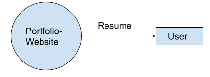

# 1.INTRODUCTION
## 1.1.  Purpose

The portfolio website is to give a prospective employer a sense of who you are, what you can do and whether you are the person they should hire to execute their project. Just as it's important to always keep our résumé/CV updated regularly, we should keep a well-maintained portfolio website that shows and tells all our latest accomplishments. The site itself is an example of what you can do.

## 1.2. Document Conventions

|       |  |
| ----------- | ----------- |
| OS      | Operating System|
| IDE   | Integrated Development Environment|
|  | |

 

# 2.REQUIREMENTS

## 2.1 Functional Requirements.

1. The home page should have a personalized logo ,photo and brief introduction about me.
2. A list and brief description of the most relevant projects done and the experience.
3. Link to download the latest resume.
4. The list of skills for a Full stack developer.
5. Links to a Bio page or About me page, Education details, Contact me, Detailed project description.
6. Link to the awards and recognitions received.
7. Social media accounts  (eg : linkedin)
 

### Context Diagram
 

 
## 2.2. Non Functional Requirements.

1. The website should be responsive and should support all major browsers.

2. **Software Requirements** 
OS:  Windows 10 or MacOS 
Technologies and frameworks: ReactJS, SASS for CSS,HTML,NodeJS
IDE: Visual Studio Code

3. **Hardware requirements** 
Memory: 4GB 
Free Space: 10GB
  

# 3. CONTENT AND NAVIGATION

## 3.1. Layout

* A header with all the links to other pages.
* A footer with the links and the terms and conditions and the logo.

## 3.2. Responsive Design

## 3.3. Visual Style

## 3.4. Colors

